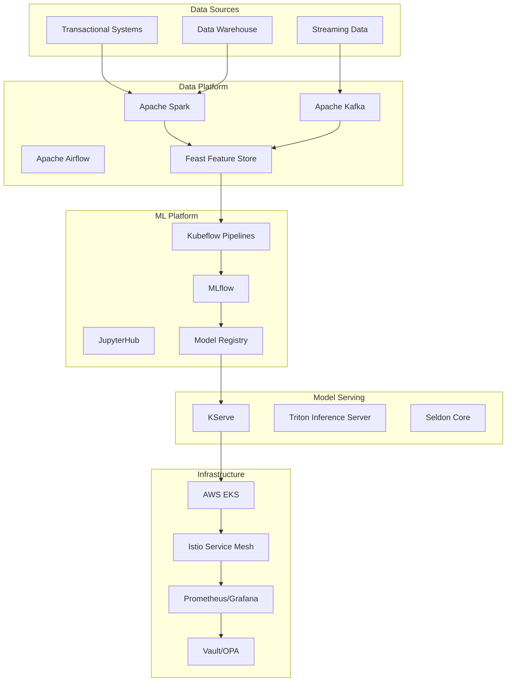

# Enterprise ML Platform Architecture

## Overview

The Enterprise ML Platform is a production-ready, cloud-native platform for machine learning operations (MLOps). It provides a complete ecosystem for data scientists and ML engineers to build, train, deploy, and monitor machine learning models at scale.

## Architecture Diagram

## Components

### 1. Data Platform
- **Apache Spark**: Distributed data processing
- **Apache Airflow**: Workflow orchestration
- **Apache Kafka**: Real-time data streaming
- **Feast**: Feature store for ML features

### 2. ML Platform
- **MLflow**: Experiment tracking and model registry
- **Kubeflow Pipelines**: ML workflow orchestration
- **JupyterHub**: Collaborative notebook environment
- **Model Registry**: Versioned model storage

### 3. Model Serving
- **KServe**: Kubernetes-native model serving
- **Triton**: High-performance inference server
- **Seldon**: Advanced ML serving features

### 4. Infrastructure
- **AWS EKS**: Managed Kubernetes
- **Istio**: Service mesh for traffic management
- **Prometheus/Grafana**: Monitoring and alerting
- **Vault/OPA**: Security and policy enforcement

## Data Flow

1. **Data Ingestion**: Data from various sources is ingested into the data platform
2. **Feature Engineering**: Features are computed and stored in Feast feature store
3. **Model Training**: Data scientists train models using Jupyter notebooks or Kubeflow pipelines
4. **Experiment Tracking**: Experiments are tracked in MLflow
5. **Model Registry**: Approved models are registered in MLflow model registry
6. **Model Serving**: Models are deployed for inference using KServe
7. **Monitoring**: Model performance and data drift are monitored in real-time
8. **Retraining**: Models are retrained based on monitoring triggers

## Security Architecture

- **Network Security**: VPC, security groups, network policies
- **Identity & Access**: IAM roles, Kubernetes RBAC, OPA policies
- **Secrets Management**: HashiCorp Vault for secure secret storage
- **Compliance**: SOC 2, GDPR, HIPAA controls
- **Encryption**: Data encryption at rest and in transit

## Scalability

- **Horizontal Scaling**: Auto-scaling for Kubernetes pods and nodes
- **Multi-Region**: Support for multi-region deployment
- **High Availability**: Multi-AZ deployment with automatic failover
- **Cost Optimization**: Spot instances, auto-scaling, resource optimization

## Monitoring & Observability

- **Metrics**: Prometheus for system and application metrics
- **Logging**: ELK stack for centralized logging
- **Tracing**: Jaeger for distributed tracing
- **Alerting**: AlertManager for incident management
- **Dashboards**: Grafana for operational dashboards